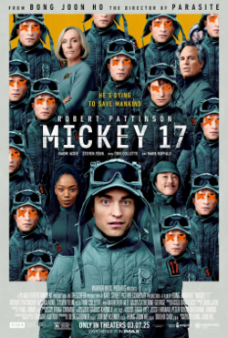

# AI Developer Mickey

> [한국어 버전](README.md)

> A practical guide for effectively utilizing generative AI assistants



## 📖 Project Overview

**AI Developer Mickey** is an educational project that documents key patterns and strategies discovered while using a generative AI assistant (Kiro CLI) to execute complex software development projects.

### Problems We Aimed to Solve

1. **Context Window Limitations**: Failures due to context window limits during complex issue analysis
2. **Loss of Session Consistency**: Loss of previous context when restarting sessions, leading to failures
3. **Lack of Knowledge Management**: Inability to effectively reuse accumulated knowledge and experience

### Core Idea

Create an AI developer agent called **"Mickey"** that saves success/failure records from each session to files, references them in subsequent sessions, and continuously improves.

### 🔄 Prompt Evolution

The Mickey prompt continues to evolve through real projects:

| Version | Project | Sessions | Key Changes |
|---------|---------|----------|-------------|
| **v2.0** | Godot Replay System | Mickey 1-6 | Session continuity, knowledge management |
| **v5.0** | Packet Capture Agent | Mickey 1-12 | Purpose-first, checklists, automation |
| **v6.1** | Mickey Self-Improvement | Mickey 13 | T3 layering, INDEX map pattern, Power steering evolution |

> 💡 **Key Insight**: AI prompts should not be "write once and done" but **continuously evolved through failure experiences**. See [Prompt Evolution Guide](docs/06-prompt-evolution-en.md) for details.

## 🎯 Learning Objectives

Through this project, you will learn:

- ✅ **Context Window Management**: How to efficiently utilize limited context
- ✅ **Context Abstraction**: Techniques to structure information and load only what's needed
- ✅ **Session Continuity**: Strategies to maintain work across sessions
- ✅ **Prompt Structuring**: Effective prompt design and improvement methods
- ✅ **Knowledge Management System**: Storing and utilizing reusable knowledge
- ✅ **Prompt Evolution**: Continuous prompt improvement through failure experiences 🆕

## 📚 Documentation Structure

### Core Guides (v2.0)

1. [Introduction to Mickey](docs/01-introduction-en.md) - Concept and design of the Mickey agent
   - [한글](docs/01-introduction.md)
2. [Context Window Management](docs/02-context-management-en.md) - Strategies for efficient context utilization
   - [한글](docs/02-context-management.md)
3. [Session Continuity](docs/03-session-continuity-en.md) - Methods to maintain consistency across sessions
   - [한글](docs/03-session-continuity.md)
4. [Prompt Engineering](docs/04-prompt-engineering-en.md) - Effective prompt structuring
   - [한글](docs/04-prompt-engineering.md)
5. [Knowledge Management System](docs/05-knowledge-management-en.md) - Building reusable knowledge
   - [한글](docs/05-knowledge-management.md)

### Prompt Evolution Guide (v5.0) 🆕

6. **[Prompt Evolution: v2.0 → v5.0](docs/06-prompt-evolution-en.md)** - Lessons from the second project ⭐
   - [한글](docs/06-prompt-evolution.md)

### AI Perspective

- [Mickey from AI's Perspective](docs/ai-perspective-en.md) - AI's postmortem and practical guide
  - [한글](docs/ai-perspective.md)

### Case Studies

| Project | Version | Status | Documentation |
|---------|---------|--------|---------------|
| Godot Replay System | v2.0 | Complete | [English](docs/case-study/godot-replay-system-en.md) / [한글](docs/case-study/godot-replay-system.md) |
| Packet Capture Agent | v5.0 | In Progress | [English](docs/case-study/packet-capture-agent-en.md) / [한글](docs/case-study/packet-capture-agent.md) 🆕 |

### Session Logs

- [Godot Project Sessions](sessions/) - Mickey 1~6
- [Packet Capture Project Sessions](sessions/packet-capture/) - Mickey 1~12 🆕

## 🚀 Quick Start

### Mickey Agent Setup

```json
{
  "name": "ai-developer-mickey",
  "description": "An AI developer that maintains session continuity and continuously improves",
  "prompt": "You are an AI developer agent 'Mickey'..."
}
```

For detailed setup, refer to [Introduction to Mickey](docs/01-introduction-en.md).

### Directory Structure

```
ai-developer-mickey/
├── docs/                    # Core guide documents
│   ├── 01-introduction.md
│   ├── 02-context-management.md
│   ├── 03-session-continuity.md
│   ├── 04-prompt-engineering.md
│   ├── 05-knowledge-management.md
│   └── case-study/         # Real-world case studies
├── sessions/               # Mickey session logs
│   ├── session_log.txt     # Mickey 1
│   ├── MICKEY-2-SESSION.md
│   ├── MICKEY-3-SESSION.md
│   ├── MICKEY-4-SESSION.md
│   ├── MICKEY-5-SESSION.md
│   └── MICKEY-6-SESSION.md
├── examples/               # Code examples
│   ├── common_knowledge/   # Knowledge management examples
│   └── context_rule/       # Context rule examples
├── power-mickey/           # [Experimental] Kiro IDE Power
└── godot-pong/            # Godot replay system code
```

## 🧪 Experimental: Kiro IDE Power

> ⚠️ **Warning**: This feature is still under testing. For stable usage, please use the Kiro CLI method above.

Mickey's core principles are also available as a Kiro IDE Power format. Power is a packaging format available in Kiro IDE 0.7+, which automatically sets up session management structure and Memory Graph MCP during onboarding.

### Installation

**Local installation:**
```bash
git clone https://github.com/hcsung/ai-developer-mickey.git
# Kiro IDE → Powers panel → Add power from Local Path → Select power-mickey folder
```

### Power Structure

```
power-mickey/
├── POWER.md              # Onboarding instructions + keyword settings
├── mcp.json              # Memory Graph MCP configuration
└── steering/             # Mickey core principles
    ├── mickey-core.md
    ├── session-protocol.md
    ├── problem-solving.md
    ├── memory-protocol.md
    └── self-improvement.md
```

### CLI vs Power Comparison

| Item | Kiro CLI (Existing) | Kiro IDE Power (Experimental) |
|------|---------------------|-------------------------------|
| Stability | ✅ Verified | ⚠️ Under testing |
| Configuration | JSON agent file | Power onboarding |
| Session Management | Manual | Automated via Hook |
| Memory Graph | Separate setup | Installed during onboarding |

## 💡 Key Insights

### 1. GenAI is a 'Combination of Past Experiences'

- **Clear context** is essential for handling completely new requirements
- **One clear instruction** is more effective than a hundred guardrails
- GenAI operates by connecting experience 'modules'

### 2. The Efficiency Trap

- Taking the simple path happens because it's 'most efficient'
- **Properly understanding context and giving instructions** minimizes side effects
- **Step-by-step testing and verification** is essential

### 3. AI as a Feedback Tool

- Use AI as a **'feedback tool'**, not a magic wand
- Resulting learning and judgment are performed by **humans**
- Continuous improvement is possible through **iterative feedback**

## 📊 Project Achievements

### Godot Replay System Development

Using Mickey, we built a complete replay and regression testing system for Godot Engine's Pong game:

- ✅ **Phase 1**: Achieved 100% pass rate (Ball reset detection)
- ✅ **Phase 2**: User guide and CI/CD integration documentation
- ✅ **Phase 3**: Multi-log batch testing infrastructure
- ✅ **Phase 3-1**: AI-based automatic scenario generation system

**Key Features:**
- Game play recording and replay
- Frame-by-frame state validation (Position, Velocity, Direction)
- Automatic bug report generation
- Headless mode batch testing
- 6 automatic scenario generation (by AI difficulty)

## 🔗 Related Links

- [Kiro CLI](https://github.com/aws/kiro-cli) - AWS's generative AI assistant
- [Godot Engine](https://godotengine.org/) - Open-source game engine
- [Packet Capture Agent](https://github.com/hcsung-aws/packet-capture-log-agent) - Second project 🆕
- [Original Notion Document](https://www.notion.so/vaneddie/Demo-AI-Developer-Mickey-Godot-2bcd0b7b36dd807f8487fd8cab537935)

## 📝 License

MIT License

## 🤝 Contributing

Issues and PRs are welcome! Please share your generative AI usage experiences.

---

**Made with ❤️ by Mickey (AI Developer Agent powered by Kiro CLI)**
