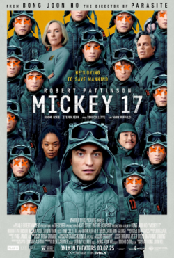

# AI Developer Mickey

> [English Version](README-en.md)

> 생성형 AI 어시스턴트를 효과적으로 활용하기 위한 실전 가이드



## 📖 프로젝트 소개

**AI Developer Mickey**는 생성형 AI 어시스턴트(Kiro)를 활용하여 복잡한 소프트웨어 개발 프로젝트를 수행하는 과정에서 발견한 핵심 패턴과 전략을 정리한 교육용 프로젝트입니다.

현재는 외부 프로젝트뿐 아니라 **Mickey 에이전트 자체를 개선하는 데에도 활용**하고 있으며, 이 과정에서 축적된 교훈과 지식이 `context_rule/`과 `common_knowledge/`에 구조화되어 다음 세션에 자동으로 반영됩니다.

### 해결하고자 한 문제

| 문제 | 해결 방법 |
|------|----------|
| **Context Window 부족** | 구조화된 문서로 필요한 정보만 로드 |
| **세션 간 일관성 상실** | 세션 로그와 핸드오프 문서로 연속성 유지 |
| **지식 관리 부재** | common_knowledge/와 context_rule/로 체계화 |

### 핵심 아이디어

**"Mickey"**라는 AI 개발자 에이전트를 만들어, 각 세션의 성공/실패 기록을 파일로 저장하고 다음 세션에서 참고하여 **지속적으로 개선**하는 방식으로 문제를 해결합니다.

```
세션 시작 → 이전 기록 참조 → 작업 수행 → 교훈 기록 → 다음 세션에 반영
```

## 🎯 학습 목표

- ✅ **Context Window 관리**: 제한된 컨텍스트를 효율적으로 활용
- ✅ **세션 간 일관성 유지**: 세션을 넘어 작업을 이어가는 전략
- ✅ **지식 관리 시스템**: 재사용 가능한 지식 저장 및 활용
- ✅ **프롬프트 진화**: 실패 경험을 통한 지속적인 개선

## 📚 문서 구조

### 핵심 가이드

| 문서 | 설명 |
|------|------|
| [Mickey 소개](docs/01-introduction.md) | Mickey 에이전트의 개념과 설계 |
| [Context Window 관리](docs/02-context-management.md) | 컨텍스트 효율적 활용 전략 |
| [세션 연속성](docs/03-session-continuity.md) | 세션 간 일관성 유지 방법 |
| [Prompt 엔지니어링](docs/04-prompt-engineering.md) | 효과적인 프롬프트 구조화 |
| [지식 관리 시스템](docs/05-knowledge-management.md) | 재사용 가능한 지식 구축 |
| [프롬프트 진화](docs/06-prompt-evolution.md) | v2.0 → v5.0 진화 과정 |
| [변경 이력](docs/07-changelog.md) | 버전별 변경사항 |
| [진화 인사이트](docs/08-evolution-insight.md) | 🆕 "AI를 잘 쓰는 법"이 어떻게 진화해 왔는가 |
| [v3 Power 마이그레이션](docs/09-v3-power-migration.md) | 🆕 CLI v2 agent → Kiro v3 Power 이전의 서사와 설계 결정 |

### 실전 사례

| 프로젝트 | 버전 | 문서 |
|----------|------|------|
| Godot 리플레이 시스템 | v2.0 | [한글](docs/case-study/godot-replay-system.md) |
| 패킷 캡처 에이전트 | v5.0 | [한글](docs/case-study/packet-capture-agent.md) |

## 🔄 프롬프트 진화

Mickey 프롬프트는 실제 프로젝트를 거치며 계속 진화합니다:

| 버전 | 핵심 변화 |
|------|----------|
| **v2.0** | 세션 연속성, 지식 관리 체계 확립 |
| **v5.0** | 목적 우선, 체크리스트, REMEMBER 섹션 |
| **v5.3** | 세션 종료 프로토콜, 자동 개선 제안 |
| **v5.4** | 필수 테스트 프로토콜 |
| **v6.0** | 경량화/최적화 - 도메인 특화 제거, 스키마 전환, 3-Tier 로딩 |
| **v6.1** | T3 계층화 - INDEX 지도 패턴 도입, Power steering 진화 |
| **v6.2** | PURPOSE-SCENARIO 기반 목적 관리 체계 도입 |
| **v6.3** | Auto Memory 패턴 도입 (자동 메모리 이원화) |
| **v7** | 자율 실행 + Subagent 협업 + Brownfield 온보딩 |
| **v7.2** | Adaptive Rules (자가 개선) + Autonomy Preference (사용자별 자율성) |
| **v7.4** | REMEMBER 은퇴 관리 (15→12) + Power Mickey 전면 동기화 |
| **v8** | 🆕 글로벌 지식 구조 (patterns/ + domain/) + 세션-PURPOSE 연결 + 포스트모템 자동 트리거 |
| **v8.1** | 🆕 Knowledge Curator subagent + domain/ 활성화 (PROFILE/GRAPH/entries) + Personal Vault → domain/ 전환 |
| **v9 (PLAN)** | 🆕 3-Tier(R/G/S) + 글로벌 도메인 중심 + knowledge-organization Skill — POSTMORTEM 기반 재설계 (Phase 1~5, 구현은 다음 세션부터) |
| **v9.1** | 🆕 v9 PLAN 보정+정착: Curator 권한 보정 + Pre-staged Apply 패턴 + T1.5 §17 Knowledge Lifecycle + §18 Activity Metrics — 5주 31세션 실측이 v9 PLAN의 "Curator 폐지" 결정 무효화 |
| **v10 (Power Migration)** | 🆕 CLI v2 agent → Kiro v3 Power 마이그레이션: steering 7개(상시 6 + on-demand 1) + 세션 hook/스크립트 + memorygraph 제거(파일 기반 지식 그래프) + install 스크립트 v3 배포 파이프라인 |

> 💡 자세한 변경 이력은 [변경 이력 문서](docs/07-changelog.md)를 참고하세요.
> 📋 **v9.1 정착 (Mickey 21~22)**: [IMPROVEMENT-PLAN-v9-ADDENDUM.md](IMPROVEMENT-PLAN-v9-ADDENDUM.md) — Curator 권한 보정 + Pre-staged Apply (ADDENDUM 우선)
> 📋 **v9 PLAN 원본 (Mickey 20)**: [IMPROVEMENT-PLAN-v9.md](IMPROVEMENT-PLAN-v9.md) — 76세션 정량 측정 기반 재설계
> 📊 **포스트모템 (M20)**: [POSTMORTEM-2026-05-14.md](POSTMORTEM-2026-05-14.md) — v8.1 활용도 진단 + 외부 트렌드 비교
> 📋 v8.1 개선 계획: [IMPROVEMENT-PLAN-v8.1.md](IMPROVEMENT-PLAN-v8.1.md)
> 🔍 진화 과정의 인사이트는 [진화 인사이트](docs/08-evolution-insight.md)를 참고하세요.

## 🚀 빠른 시작

### 1. 설치

```bash
# Kiro CLI 설치 후 (https://github.com/aws/kiro-cli)
git clone https://github.com/hcsung-aws/ai-developer-mickey.git
cd ai-developer-mickey
```

**macOS / Linux / WSL:**
```bash
./install.sh
```

**Windows (PowerShell):**
```powershell
.\install.ps1
```

`install.sh` / `install.ps1`이 수행하는 것:
- Agent JSON → `~/.kiro/agents/` (CLI v2)
- 글로벌 가이드 → `~/.kiro/mickey/`
- v3 Power → `~/.kiro/powers/installed/power-mickey/` (kiro-cli 2.10 이상일 때. 미만이면 자동으로 건너뜀)

> v3 배포는 `scripts/deploy_power.py`가 담당하며, 기존 설치본을 백업한 뒤 교체합니다. 변경 없이 계획만 보려면 `python scripts/deploy_power.py --dry-run`을 실행하세요.

### 2. 프로젝트에서 Mickey 실행

세 가지 사용 방식이 있습니다.

| 시나리오 | 실행 방법 | 설명 |
|----------|----------|------|
| **CLI v2** | `kiro-cli chat --agent ai-developer-mickey` | v17 프롬프트(agent JSON) 직접 사용. 검증된 안정 경로 |
| **CLI v3** | `kiro-cli chat` | power-mickey가 자동 인식됨. steering 상시 6 + on-demand 1 로딩 (kiro-cli 2.10+) |
| **Kiro IDE** | Powers 패널에서 power-mickey 활성 | 동일한 steering을 IDE에서 사용 |

```bash
cd <프로젝트 디렉토리>
kiro-cli chat --agent ai-developer-mickey   # CLI v2
```

### 3. Mickey가 자동으로 수행하는 것

- 프로젝트 분석 및 문서 생성
- 세션 로그 작성 (MICKEY-N-SESSION.md)
- 교훈 기록 및 다음 세션 인수인계

## 💡 핵심 인사이트

### AI는 피드백 도구

- AI를 '도깨비방망이'가 아닌 **'피드백 도구'**로 활용
- 결과적인 학습과 판단은 **사람**이 수행
- 지속적인 개선은 **반복적인 피드백**을 통해 가능

### 프롬프트는 진화한다

- "한 번 작성하고 끝"이 아님
- **실패 경험을 통해 지속적으로 개선**
- 각 세션의 교훈을 프롬프트에 반영

## 📁 디렉토리 구조

```
ai-developer-mickey/
├── docs/                    # 핵심 가이드 문서
├── sessions/               # Mickey 세션 로그 예시
├── examples/               # 설정 파일 및 예시
│   ├── ai-developer-mickey.json  # 최신 프롬프트
│   ├── knowledge-curator.json    # Knowledge Curator subagent
│   ├── common_knowledge/   # 지식 관리 예시
│   └── context_rule/       # 컨텍스트 규칙 예시
├── context_rule/           # 이 프로젝트의 컨텍스트 규칙 (Mickey가 자기 개선 시 활용)
├── common_knowledge/       # 이 프로젝트의 범용 지식
├── power-mickey/           # Kiro v3 Power (v10 — CLI v3 + IDE)
└── godot-pong/            # Godot 리플레이 시스템 코드
```

## ⚡ Kiro v3 Power (v10)

Mickey를 Kiro v3 Power 형식으로도 제공합니다 (v10 마이그레이션). steering을 진입점으로 삼고 상세 지식은 필요할 때만 pull하는 progressive disclosure 구조로, **CLI v3와 Kiro IDE 양쪽에서 동일하게 동작**합니다. 자세한 서사와 설계 결정은 [v3 Power 마이그레이션](docs/09-v3-power-migration.md)을 참고하세요.

### 설치 방법

위의 `install.sh` / `install.ps1`이 kiro-cli 2.10 이상이면 자동으로 배포합니다 (`~/.kiro/powers/installed/power-mickey/`).

**Kiro IDE 로컬 설치:**
```bash
git clone https://github.com/hcsung-aws/ai-developer-mickey.git
# Kiro IDE → Powers 패널 → Add power from Local Path → power-mickey 폴더 선택
```

### Power 구조

```
power-mickey/
├── POWER.md              # 온보딩 지침 + steering 매핑 + 활성화 트리거
├── mcp.json              # aws-knowledge-mcp-server (memorygraph는 v10에서 제거)
└── steering/             # 상시 6 + on-demand 1
    ├── mickey-core.md          # Core Identity + REMEMBER 12
    ├── session-protocol.md     # 세션 4단계 프로토콜
    ├── knowledge-graph.md      # 지식 그래프 접근 규약
    ├── problem-solving.md      # 문제 해결 10단계
    ├── document-schema.md      # 문서 스키마
    ├── context-window.md       # context window 관리
    └── knowledge-curator.md    # (manual) 세션 종료 시에만 pull
```

### CLI v2 vs v3 Power 비교

| 항목 | Kiro CLI v2 (agent JSON) | Kiro v3 Power |
|------|--------------------------|---------------|
| 프롬프트 로딩 | v17 전체 상주 | steering 상시 6 + on-demand 1 + 그래프 노드 pull |
| 지식 그래프 | 파일 기반 (`~/.kiro/mickey/`) | 동일 (memorygraph MCP 제거) |
| 세션 관리 | 수동 | CLI v3 hook(`SessionStart`/`Stop`) + 스크립트 |
| 사용 환경 | CLI | CLI v3 + Kiro IDE |

## 🔗 관련 링크

- [Kiro CLI](https://github.com/aws/kiro-cli) - AWS의 생성형 AI 어시스턴트
- [AI Agent 자동화 플랫폼](https://github.com/hcsung-aws/ai-agent-automation-platform) - Mickey 활용 프로젝트

## 📝 라이선스

MIT License

## 🤝 기여

이슈와 PR을 환영합니다! 생성형 AI 활용 경험을 공유해주세요.

---

**Made with ❤️ by Mickey (AI Developer Agent powered by Kiro CLI)**
